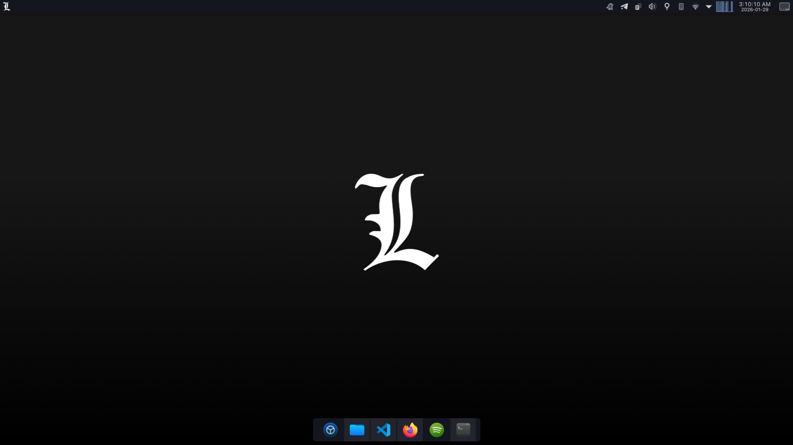
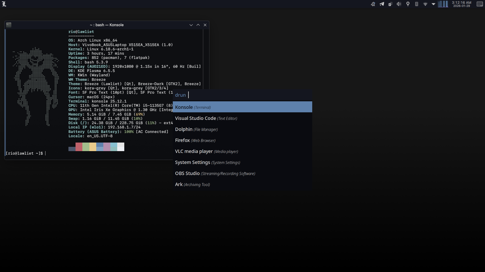

# Lawliet KDE Theme

A custom "Death Note" inspired KDE Plasma customization. Not the best rice, but I really love it (my first rice). It doesn't require you to install a theme engine like Kvantum :)




<!--  -->

## 📂 Structure

- **OS:** Arch Linux (or derivatives)
- **DE:** KDE Plasma 6
- **Launcher:** Rofi (Custom theme included)
- **Terminal Info:** Fastfetch
- **Icons:** Kora Grey
- **Cursor:** macOS Cursor

## 📦 Dependencies

To achieve the exact look and functionality, you will need the following installed:

### 1. Fonts (Important)

This setup uses **SF Mono** and **SF Pro**. Due to licensing, these are **not** included in this repository.

- **Arch Linux Users:** Install via AUR:
  ```bash
  yay -S apple-fonts
  ```

### 2. Global Menu Support

Required for the global menu widget to work with GTK applications:

- `appmenu-gtk-module`
- `libdbusmenu-glib`
- `libdbusmenu-gtk3`

### 3. Tools

- `rofi` (Application launcher)
- `fastfetch` (Terminal info display)

## 🛠️ Installation

### Manual

1. **Colors:** Move `colors/Lawliet.colors` to `~/.local/share/color-schemes/`.
2. **Konsole:** Move `colors/Lawliet.colorscheme` to `~/.local/share/konsole/`.
3. **Icons/Cursor:** Move `assets/kora-grey` and `assets/macOS-cursor` to `~/.local/share/icons/`.
4. **Wallpaper:** Move `assets/Wallpaper.jpg` to your preferred wallpaper directory.
5. **Fastfetch:** Copy contents of `configs/fastfetch/` to `~/.config/fastfetch/`.
6. **Rofi:** Copy `configs/rofi/config.rasi` and `configs/rofi/squared-lawliet.rasi` to `~/.config/rofi/`.
7. **KDE Configs:** Carefully merge or replace `kdeglobals` and `plasma-org.kde.plasma.desktop-appletsrc` in `~/.config/`.
8. **Desktop Effects:** Enable **Blur** and **Translucency** from `System Settings > Apps & Windows > Window Management > Desktop Effects`.

## 📜 Credits

- **Icons:** [Kora Icons](https://github.com/bikass/kora) (Grey variant)
- **Wallpaper:** Custom made
